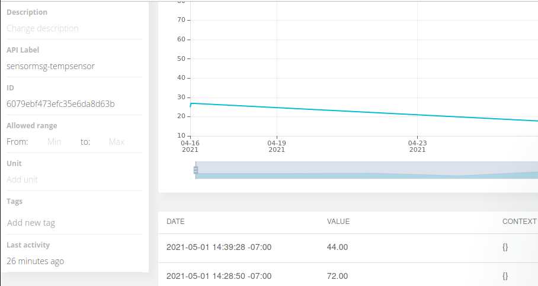
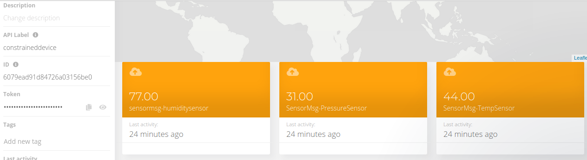
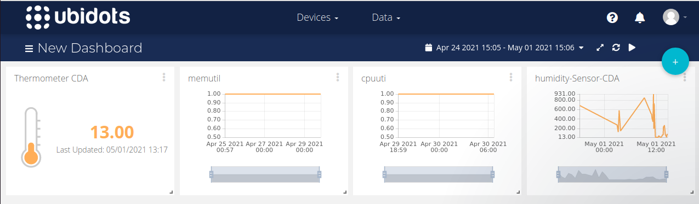

# Lab Module 12 - Semester Project - Final Write-up

NOTE: Be sure to implement all the Lab Module 12 requirements listed at [Lab Module 12](https://github.com/orgs/programming-the-iot/projects/1#column-10488565).

## Description

Describe your idea in 1 paragraph (at least 2 or 3 sentences).

I will be building home automation system that will havecontrol the temperature, humidity and pressure inside home. The system will consist of CDA, GDA and cloud application Ubidots.
## What - The Problem 

What problem did you tackle and why does it matter? Write 1 to 2 paragraphs in response.
 I will be building home automation system that provides remote user interface for home applications to enable better control and monitoring.

## Why - Who Cares? 

Why do you care about this particular problem? Write 1 to 2 paragraphs in response.
 I care about this problem particularly because it will reduce energy consumption. Electricity is a very valuable resource and it is imperative to cut down the usage as much as possible. In certain parts of the world there is still a scaracity of electricity, thus deploying this system will definitely help.

## How - Expected Technical Approach

Write 1 to 2 paragraphs describing the outcomes you achieved.

Sense hat emulator or simulators will be used to generate temperature, pressure, humidity sensor data
Data collected from these sensors and system performance data will be sent to GDA
CDA and GDA will be connected using MQTT protocol
Ubidots cloud service is used

Write 1 to 2 paragraphs describing your design.

- CDA collects data from 3 sensors and acts as interface between sensors and actuators. 
- GDA processes data received from CDA and sends it to Ubidots cloud.
- CDA and GDA communicate using encrypted MQTT connection
- GDA generates its own system performance data to send it to cloud
- CLOUD service stores the received data and performs data analytics

### What THREE (3) sensors and ONE (1) actuator did you use (add more if you wish)?

- CDA Sensor 1: Temperature

- CDA Sensor 2: Pressure

- CDA Sensor 3: Humidity

### What ONE (1) CDA protocol and TWO (2) GDA protocols did you implement (add more if you wish)?

- CDA to GDA Protocol: MQTT 

- GDA to Cloud Protocol: MQTT with TLS encryption

 
### What TWO (2) cloud services / capabilities did you use (add more if you wish)?

- Cloud Service 1 (data ingress - all inputs):Ubidots

- Capabilities of Ubidots used:
- data visualization

## Screen Shots Representing Cloud Services

 

### Screen Shots Representing Visualized Data

NOTE: Include (at least) TWO (2) screen shots - one showing at least 1 hour
of time-series data from the CDA, and one showing an event being triggered
that results in an actuation event sent to your GDA and then to your CDA.

 

EOF.

