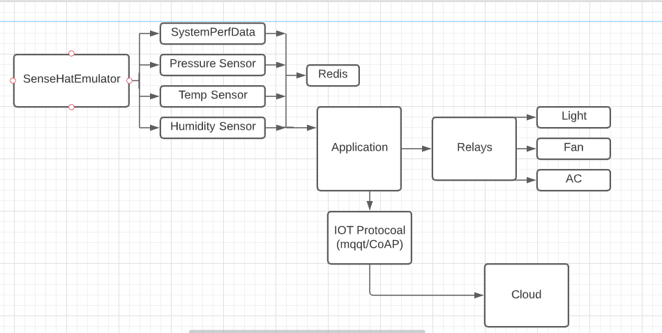

# Lab Module 12 - Semester Project Proposal

## Description

Describe your idea in 1 paragraph (at least 2 or 3 sentences).

## What - The Problem 

What problem are you trying to solve and why does it matter? Write 1 to 2 paragraphs in response.

Ans : I would like resolve the home syetem problem by making it automatic and remotely controlled. This will provide user better control and monitoring dashboard.

## Why - Who Cares? 

Why do you care about this particular problem? Write 1 to 2 paragraphs in response.

Ans: Most of the equipments work on electricity and security is most important in the home. By implementing home automation we can save valuable electricity and other resources and improve security.

## How - Expected Technical Approach

How do you plan to tackle this problem technically?

Include a high-level design diagram depicting your planned technical approach - it does not need to be final, but it must include the CDA, GDA, and cloud services you plan to use, as well as the protocol(s) you will use for communicating between the devices and the cloud.

Write 1 to 2 paragraphs describing your diagram.

Include a high-level design diagram depicting your planned technical approach - it does not need to be final, but it must include the CDA, GDA, and cloud services you plan to use, as well as the protocol(s) you will use for communicating between the devices and the cloud.

  
Ans:
@ By using Sense hat emulator can generate temp, pressure, humidity data which is vital in home automation
@ Redis database can be used to store this data and this collected data will be sent to Gateway Device Adapter.
@ I am planning to use cloud service so that we can create web app in future and this data can be use to display attractive dashboard and can create centralised management system.

## Results - Expected Outcomes 

If your project is successful, what outcome do you expect (e.g. what will happen if everything works)? Write 1 to 2 paragraphs describing your expected outcomes.

Ans:
@ Energy Saving
@ Security 
@ Monitoring
@ Automation
@ can Manage Multiple Projects/Homes Efficiently

EOF.
